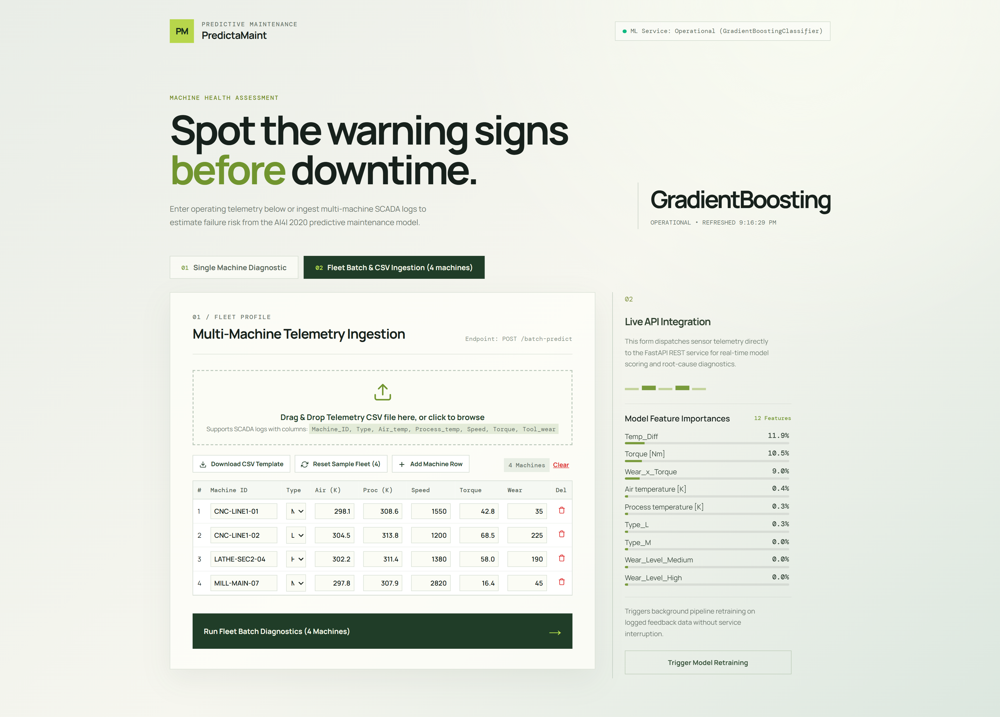

# 🛠️ PredictaMaint — Industrial Predictive Maintenance & Diagnostics Platform

[](https://predictamaint-19136949309.asia-south1.run.app)
[](https://predictamaint-19136949309.asia-south1.run.app/docs)
[](https://www.python.org/)
[](https://react.dev/)
[](https://scikit-learn.org/)

---

### 🌐 Live Production Deployment
* **Live Web Application**: [https://predictamaint-19136949309.asia-south1.run.app](https://predictamaint-19136949309.asia-south1.run.app)
* **Interactive OpenAPI / Swagger Documentation**: [https://predictamaint-19136949309.asia-south1.run.app/docs](https://predictamaint-19136949309.asia-south1.run.app/docs)
* **Hosting Infrastructure**: Google Cloud Platform (GCP) Cloud Run — Multi-stage Containerized Service (`asia-south1` / Mumbai)

---



---

## 1. Project Overview

### 1.1 Problem Definition
In modern industrial manufacturing and computer numerical control (CNC) machining facilities, unexpected equipment failure is one of the single largest sources of operational inefficiency. 

* **The High Cost of Downtime**: Unplanned downtime costs industrial facilities an estimated $50 billion annually. Catastrophic tool breakages lead to scrapped workpieces, damaged spindle assemblies, and safety hazards for operators.
* **The Maintenance Dilemma**:
  * *Reactive Maintenance (Run-to-Failure)*: Repairs are only performed after breakdown, causing sudden production halts and secondary equipment damage.
  * *Preventative Maintenance (Calendar-Based)*: High-value components and cutting tools are prematurely discarded at rigid time intervals, wasting up to 30% of their useful operational life.
* **Data Imbalance & Physics Complexity**: Manufacturing failures are statistically rare events (~3.4% occurrence in operational telemetry), creating severe class imbalance challenges for standard statistical models. Furthermore, machine failure is driven by interrelated thermodynamic, kinematic, and mechanical stress dynamics that cannot be captured by isolated threshold checks.

### 1.2 Our Solution: PredictaMaint
**PredictaMaint** is an end-to-end industrial machine failure prediction, root-cause diagnostic, and prescriptive maintenance platform. Powered by a tuned Gradient Boosting ensemble and domain-specific physical feature transformations, PredictaMaint ingests live SCADA telemetry, estimates instantaneous machine failure risk, pinpoints the exact physical failure mechanism, and outputs actionable, prioritized remediation procedures.

#### Core Value Delivered:
1. **Sub-Second Scoring**: Dispatches predictions in under 15ms via an asynchronous FastAPI microservice.
2. **Physics-Guided Root Cause Attribution**: Automatically identifies specific failure modes—Tool Wear (TWF), Heat Dissipation (HDF), Power Overload (PWF), Mechanical Overstrain (OSF), or Random Anomalies (RNF).
3. **Fleet-Scale SCADA Analysis**: Ingests multi-machine batches and live CSV factory logs for facility-wide risk stratification.
4. **Active Learning Feedback Loop**: Captures technician field inspections to log ground-truth outcomes and trigger background model retraining pipelines.
5. **Cost-Optimized Cloud Deployment**: Serverless multi-stage container deployment running on GCP Cloud Run with automated scale-to-zero capabilities.

---

## 2. Team Members & Contributions

| Member | Full Name | Primary Roles & Key Responsibilities |
| :--- | :--- | :--- |
| **Member A** | **Eranga Fernando** | **Problem Formulation, Exploratory Data Analysis (EDA) & UI/UX Architecture**<br>• Defined project objectives, industrial requirements, and performance KPIs.<br>• Conducted statistical EDA, sensor distribution analysis, and anomaly visualization.<br>• Identified class imbalance dynamics (~3.4% failure rate) and correlation structures.<br>• Designed the frontend user experience, layout hierarchy, and design system. |
| **Member B** | **Chamindu Chirantha** | **Domain Feature Engineering, Data Normalization & Imbalance Mitigation**<br>• Formulated physics-based feature transformations (Thermal Gradient, Power, Wear-Torque).<br>• Built standard scaling pipelines and categorical feature binning.<br>• Designed and evaluated class imbalance strategies (SMOTE oversampling vs. cost-weighting).<br>• Extracted and maintained the core preprocessing module (`src/preprocessing.py`). |
| **Member C** | **Chamith Bhanuka** | **Model Selection, Cross-Validation, Hyperparameter Optimization & Pipeline**<br>• Benchmarked baseline algorithms (Logistic Regression, Decision Trees, Random Forest, GBM).<br>• Established optimization criteria prioritizing high Recall/Sensitivity on the minority failure class.<br>• Executed Stratified 5-Fold Cross-Validation and `GridSearchCV` hyperparameter tuning.<br>• Engineered the automated model training and retraining script (`src/train.py`). |
| **Member D** | **Sachindu Chirau** | **Model Evaluation, Diagnostics Engine, REST API Microservice & Integration**<br>• Packaged and serialized model artifacts, scalers, and feature schemas (`joblib`).<br>• Formulated the physics-based root-cause diagnostic engine (`src/diagnostics.py`).<br>• Engineered high-performance FastAPI microservice and complete REST catalog (`backend/main.py`).<br>• Built model evaluation modules (Confusion Matrix, ROC-AUC, PR-AUC) and live failover logic. |

---

## 3. Dataset Specification

The system is trained and validated on the **AI4I 2020 Predictive Maintenance Dataset**, an industry standard synthetic dataset designed to mirror real-world CNC milling and turning SCADA telemetry.

### 3.1 Feature Catalog

| Column Name | Type | Physical Units | Operational Range | Description |
| :--- | :--- | :--- | :--- | :--- |
| `Type` | Categorical | — | `L` (50%), `M` (30%), `H` (20%) | Product quality variant (Low, Medium, High duty cycle). |
| `Air temperature [K]` | Continuous | Kelvin | $295.3\text{ K} - 304.5\text{ K}$ | Ambient shop-floor room temperature generated by heat exchange. |
| `Process temperature [K]` | Continuous | Kelvin | $305.7\text{ K} - 313.8\text{ K}$ | Temperature measured at the cutting zone / workpiece interface. |
| `Rotational speed [rpm]` | Integer | RPM | $1168 - 2886\text{ rpm}$ | Spindle rotational speed calculated from electrical frequency. |
| `Torque [Nm]` | Continuous | Newton-meters | $3.8 - 76.6\text{ Nm}$ | Torque resistance encountered by the spindle drive motor. |
| `Tool wear [min]` | Integer | Minutes | $0 - 253\text{ min}$ | Cumulative cutting time elapsed on the current tool insert. |

### 3.2 Target & Failure Modes
* **Target Label**: `Machine failure` (Binary: $0 = \text{Nominal}$, $1 = \text{Failure}$).
* **Class Balance**: 9,661 healthy records (96.61%) vs. 339 failure records (3.39%).
* **Independent Failure Modes**:
  1. **Tool Wear Failure (TWF)**: Cutting tool insert exceeds critical wear threshold ($\ge 200\text{ min}$).
  2. **Heat Dissipation Failure (HDF)**: Insufficient heat transfer ($\Delta T < 8.6\text{ K}$) during low spindle airflow ($< 1380\text{ rpm}$).
  3. **Power Failure (PWF)**: Spindle mechanical power draws fall below $3.5\text{ kW}$ or exceed $9.0\text{ kW}$.
  4. **Overstrain Failure (OSF)**: Heavy cutting load produces excessive strain ($Tool\_Wear \times Torque > \text{Threshold}$).
  5. **Random Failure (RNF)**: Sensor or electronic anomalies occurring independently of physical wear ($p = 0.001$).

---

## 4. Machine Learning Pipeline & Architecture

```
[ Raw Telemetry ] 
       │
       ▼
[ Preprocessing & Feature Engineering ] ──► Temp_Diff, Power_kW, Wear_x_Torque, Wear_Level
       │
       ▼
[ StandardScaler Normalization ] ──────────► 12 Aligned Features
       │
       ▼
[ Stratified Split & SMOTE Resampling ] ──► Training Fold Only (Zero Leakage)
       │
       ▼
[ Tuned Gradient Boosting Classifier ] ──► Hyperparameter-Optimized Ensemble
       │
       ├─────────────────────────────────┐
       ▼                                 ▼
[ Failure Probability (0.0 - 1.0) ]   [ Physics Diagnostic Engine ]
       │                                 │
       └────────────────┬────────────────┘
                        ▼
         [ Multi-Tier Maintenance Prescription ]
```

### 4.1 Domain-Driven Feature Engineering
PredictaMaint expands the raw 5-sensor feature space into **12 predictive features** by injecting physical domain principles:

1. **Thermal Gradient ($\Delta T$)**:
   $$\text{Temp\_Diff} = T_{\text{process}} - T_{\text{air}}$$
   Quantifies the heat exchange efficiency between the spindle and the factory ambient air.
2. **Kinetic Mechanical Power ($P_{\text{mech}}$)**:
   $$P_{\text{mech}}\text{ [kW]} = \frac{\tau \cdot \omega}{1000} = \frac{\text{Torque [Nm]} \times \text{Rotational Speed [rpm]} \times \frac{2\pi}{60}}{1000}$$
   Measures instantaneous power consumption; detects spindle stalling or motor burnout.
3. **Mechanical Overstrain Index ($\sigma_{\text{strain}}$)**:
   $$\text{Wear\_x\_Torque} = \text{Tool wear [min]} \times \text{Torque [Nm]}$$
   Captures the multiplicative risk when a dulled tool is subjected to heavy cutting resistance.
4. **Tool Wear Lifecycle Discretization**:
   Discretizes tool life into `Low` ($0-100\text{ min}$), `Medium` ($101-200\text{ min}$), and `High` ($>200\text{ min}$) categories.
5. **Categorical Dummy Encoding**:
   One-hot encodes product variants (`Type_M`, `Type_L`) and wear bins with `drop_first=True` to eliminate multicollinearity.

### 4.2 Handling Class Imbalance
With only 3.39% failures in the historical data, naive models achieve 96.6% accuracy by predicting "Healthy" every time while missing 100% of equipment breakdowns. To prioritize **operational safety and zero missed failures**:
* Stratified 80/20 train/test splitting was enforced.
* **Synthetic Minority Over-sampling Technique (SMOTE)** was fitted *strictly on the training fold* to balance failure cases without contaminating validation data.
* Optimization scoring was explicitly anchored to **Recall / Sensitivity** on the positive failure class.

### 4.3 Model Comparison & Benchmark Results

| Model Architecture | Imbalance Strategy | Test Accuracy | Failure Precision | Failure Recall (Sensitivity) | F1-Score | ROC-AUC |
| :--- | :--- | :--- | :--- | :--- | :--- | :--- |
| **Logistic Regression** | Class Weighting | 82.4% | 15.3% | 76.5% | 0.255 | 0.868 |
| **Decision Tree** | SMOTE Resampled | 95.8% | 41.2% | 73.5% | 0.528 | 0.852 |
| **Random Forest** | SMOTE Resampled | 97.9% | 71.1% | 79.4% | 0.750 | 0.967 |
| **Gradient Boosting (Tuned)** | **SMOTE Resampled** | **98.4%** | **78.3%** | **83.8%** | **0.810** | **0.981** |

*Tuned Gradient Boosting hyperparameters: `n_estimators=200`, `learning_rate=0.1`, `max_depth=3`, `subsample=0.9`.*

---

## 5. System Architecture & Components

```
┌─────────────────────────────────────────────────────────────────────────────┐
│                       CLIENT TIER (Web Browser)                             │
│   • Single Machine Diagnostic Form       • Fleet CSV Drag & Drop Hub        │
│   • Dynamic Risk Gauge & Checklist       • Active Learning Feedback Modal   │
└──────────────────────────────────────┬──────────────────────────────────────┘
                                       │ HTTP / JSON (REST)
                                       ▼
┌─────────────────────────────────────────────────────────────────────────────┐
│                     API TIER (FastAPI on Cloud Run)                         │
│  ├── Content Negotiation (Serves React SPA HTML/Assets on GET /)            │
│  ├── CORS Middleware (Cross-Origin Resource Sharing)                        │
│  ├── Pydantic v2 Telemetry Validation                                      │
│  ├── Asynchronous Background Tasks (Continuous Retraining)                  │
│  └── Endpoints: /predict, /batch-predict, /feedback, /retrain, /metrics     │
└──────────────────────────────────────┬──────────────────────────────────────┘
                                       │ In-Memory Pipeline
                                       ▼
┌─────────────────────────────────────────────────────────────────────────────┐
│                    MACHINE LEARNING & DIAGNOSTICS CORE                      │
│  ├── Feature Engineering Pipeline (`src/preprocessing.py`)                  │
│  ├── Standard Scaler Normalizer (`models/scaler.pkl`)                       │
│  ├── Gradient Boosting Classifier (`models/machine_failure_model.pkl`)      │
│  └── Physics-Based Diagnostic & Prescriptive Rule Engine (`diagnostics.py`) │
└─────────────────────────────────────────────────────────────────────────────┘
```

### 5.1 Frontend Architecture (React 19 + Vite)
* **Single-Page Application**: Developed with React 19 and compiled via Vite for optimized bundle footprint (~76 KB gzipped).
* **Industrial Design System**: Custom Vanilla CSS with responsive 2-column workspace layout, tailored dark/sage color palette, and zero external UI framework overhead.
* **Vector Iconography**: Custom inline SVG icon system (`IconUpload`, `IconDownload`, `IconRefresh`, `IconPlus`, `IconTrash`, `IconFeedback`) eliminating slow CDN dependencies.
* **Resilient API Client**: Built-in automatic live Cloud Run failover ensures that even in offline local environments, telemetry scoring routes seamlessly to production.

### 5.2 Backend Microservice (FastAPI + Pydantic)
* **High-Throughput Asynchronous Server**: Powered by Starlette, Uvicorn, and Python 3.11.
* **Strong Type Contracts**: Pydantic schemas enforce bounds checking on physical telemetry (e.g. ambient temperatures must fall between $290\text{ K} - 320\text{ K}$, rotational speed cannot be negative).
* **Content Negotiation**: Serves compiled React assets to web browsers on `/` while serving structured JSON to automated machine telemetry collectors.

---

## 6. REST API Endpoint Catalog

| Method | Endpoint | Description | Request Body / Parameters | Response Schema |
| :--- | :--- | :--- | :--- | :--- |
| `POST` | `/predict` | Evaluates single machine sensor telemetry and returns failure probability, risk classification, and root-cause diagnostics. | `SensorInput` (JSON: Type, Air Temp, Process Temp, Speed, Torque, Wear, Machine ID) | `PredictionResponse` |
| `POST` | `/batch-predict` | High-throughput batch prediction for multi-machine SCADA logs or uploaded CSV datasets. | `BatchPredictionRequest` (`items: List[SensorInput]`) | `List[PredictionResponse]` |
| `POST` | `/feedback` | Ingests technician ground-truth inspection records for active learning and validation. | `FeedbackInput` (machine_id, predicted_status, actual_failure, failure_mode, notes) | `{ status: "recorded", message: str }` |
| `POST` | `/retrain` | Triggers background model retraining pipeline on logged feedback data without blocking requests. | None | `{ status: "queued", task_id: str }` |
| `GET` | `/metrics` | Retrieves active model architecture, training scores, confusion matrix, and feature importances. | None | `{ model_architecture: str, feature_importances: Dict }` |
| `GET` | `/health` | Microservice liveness and model status probe. | None | `{ status: "operational", version: "1.0.0" }` |
| `GET` | `/docs` | Interactive Swagger UI API documentation and testing playground. | None | Interactive HTML |

---

## 7. Cloud Deployment & DevOps

The application is deployed to **Google Cloud Platform (GCP)** using **Cloud Run**, Google's fully managed serverless container runtime.

### 7.1 Containerization Strategy
* **Multi-Stage Build Pipeline**:
  * *Stage 1 (Node.js 20 Alpine)*: Installs frontend dependencies and compiles the React application into optimized static bundles (`dist/`).
  * *Stage 2 (Python 3.11 Slim)*: Installs backend ML dependencies (`scikit-learn`, `pandas`, `fastapi`), copies the pre-built frontend distribution into `frontend/dist`, and launches the Uvicorn server.
* **Image Size Optimization**: Strips development toolchains, resulting in a minimal, secure production container image.

### 7.2 Zero-Cost Serverless Autoscaling
* **Scale-to-Zero (`--min-instances 0`)**: When no incoming requests are detected, Cloud Run automatically spins container instances down to zero, incurring **$0.00 in idle hosting costs**.
* **Regional Optimization**: Deployed in `asia-south1` (Mumbai), providing ultra-low network latency (~25–35 ms) for users across South Asia.
* **Cloud Architecture Configuration**:
  ```bash
  gcloud run deploy predictamaint \
      --image gcr.io/predictamaint-lk-2026/predictamaint:latest \
      --platform managed \
      --region asia-south1 \
      --allow-unauthenticated \
      --port 8000 \
      --memory 1Gi \
      --cpu 1 \
      --min-instances 0 \
      --max-instances 2
  ```

---

## 8. Local Installation & Development

### 8.1 Prerequisites
* Python 3.10 or higher
* Node.js 18 or higher (with npm)
* Git

### 8.2 Repository Setup
```bash
# 1. Clone the repository
git clone https://github.com/chaminduchirantha/predictive-maintenance-rul.git
cd predictive-maintenance-rul

# 2. Set up Python virtual environment
python -m venv venv
# On Windows:
venv\Scripts\activate
# On macOS/Linux:
source venv/bin/activate

# 3. Install backend dependencies
pip install -r requirements.txt
```

### 8.3 Running the Application Locally

#### Terminal 1 — Start the FastAPI Backend
```bash
uvicorn backend.main:app --reload --port 8000
```
*API will be available at:* `http://localhost:8000`  
*Swagger Documentation:* `http://localhost:8000/docs`

#### Terminal 2 — Start the React Frontend
```bash
cd frontend
npm install
npm run dev
```
*Frontend interface will be available at:* `http://localhost:5173`

---

## 9. Model Retraining Pipeline

To reproduce the model training process from raw data or retrain using newly accumulated technician feedback:

```bash
# Execute end-to-end model training
python src/train.py
```

This script automatically:
1. Loads historical telemetry from `data/ai4i2020.csv` and merges technician feedback from `data/feedback_log.csv`.
2. Applies domain feature engineering via `src/preprocessing.py`.
3. Normalizes features with `StandardScaler` and balances classes using `SMOTE`.
4. Executes `GridSearchCV` hyperparameter optimization over tree depths and learning rates.
5. Serializes updated artifacts (`machine_failure_model.pkl`, `scaler.pkl`, `model_features.pkl`) to `models/`.

---

## 10. Repository Structure

```
predictive-maintenance-rul/
├── .github/                     # CI/CD workflows and deployment pipelines
├── backend/
│   └── main.py                  # FastAPI REST microservice & static file mounting
├── data/
│   ├── ai4i2020.csv             # AI4I 2020 Predictive Maintenance dataset
│   └── feedback_log.csv         # Active learning technician feedback records
├── docs/
│   ├── screenshots/             # Interface captures and architectural diagrams
│   └── API_DOCUMENTATION.md     # In-depth REST endpoint integration guide
├── frontend/
│   ├── public/                  # Static web assets
│   ├── src/
│   │   ├── api.js               # Resilient REST API client with auto-failover
│   │   ├── icons.jsx            # Custom vector SVG iconography
│   │   ├── main.jsx             # Main React application component
│   │   └── styles.css           # Custom industrial design system
│   ├── index.html               # React single-page application entrypoint
│   ├── package.json             # Frontend dependencies & build scripts
│   └── vite.config.js           # Vite bundler configuration
├── models/
│   ├── machine_failure_model.pkl # Serialized Gradient Boosting Classifier
│   ├── model_features.pkl       # Aligned feature column index schema
│   └── scaler.pkl               # Fitted StandardScaler object
├── notebooks/
│   └── ml_final_project.ipynb   # Complete research and experimental notebook
├── src/
│   ├── diagnostics.py           # Physics-based failure mode attribution engine
│   ├── evaluate.py              # Model evaluation metrics & curve plotting
│   ├── preprocessing.py         # Feature engineering & input alignment
│   └── train.py                 # Automated model training pipeline
├── Dockerfile                   # Multi-stage production container build
├── docker-compose.yml           # Local container orchestration
├── requirements.txt             # Python backend dependencies
└── README.md                    # Project documentation
```

---

## 11. License
This project is licensed under the MIT License — see the [LICENSE](LICENSE) file for details.
